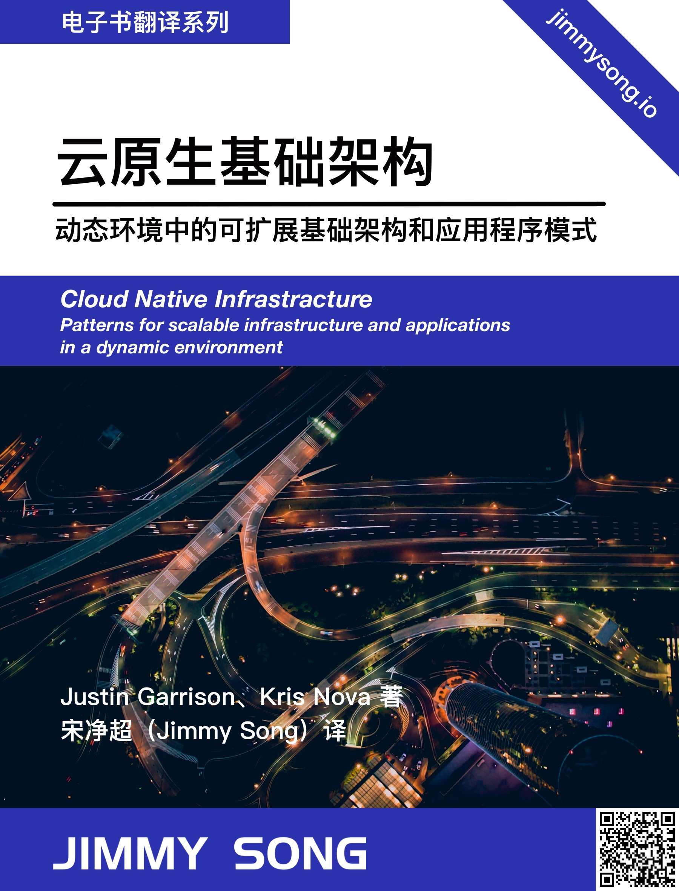

# 云原生基础架构

《云原生基础架构》，Cloud Native Infrastructure 中文版。

  

本书为*Cloud Native Infrastructure*中文版，作者*Justin Garrison*和*Kris Nova*，英文版发行于 2017 年 11 月，已可以在网上免费获得，本书是关于创建和管理基础架构，以适用于云原生应用全生命周期管理的模式和实践。

阅读完这本书后，您将会有如下收获：

- 理解为什么说云原生基础架构是高效运行云原生应用所必须的
- 根据准则来决定您的业务何时以及是否应该采用云原生
- 了解部署和管理基础架构和应用程序的模式
- 设计测试以证明您的基础架构可以按预期工作，即使在各种边缘情况下也是如此
- 了解如何以策略即代码的方式保护基础架构

### 使用方式

您可以通过以下方式使用本书：

- GitHub地址：https://github.com/rootsongjc/cloud-native-infra
- GitBook在线浏览：https://jimmysong.io/cloud-native-infra
- 下载离线版：https://github.com/rootsongjc/cloud-native-infra/releases/tag/v20200214

## 鸣谢

本仓库基于 <https://github.com/CloudNativeInfra/cni> 编写，感谢原仓库贡献者的内容组织和翻译。

## 社区

[点击加入云原生社区](https://jimmysong.io/contact)

## 免责声明

本书英文版版权属于 O’Reilly，中文版版权归属于机械工业出版，基于[署名-非商业性使用-相同方式共享 4.0（CC BY-NC-SA 4.0）](https://creativecommons.org/licenses/by-nc-sa/4.0/deed.zh)分享，本书为云原生爱好者翻译，仅可用于学习和交流目的，请勿私自印制贩卖，如有需要请[购买纸质书](https://item.jd.com/12432007.html)。

  

